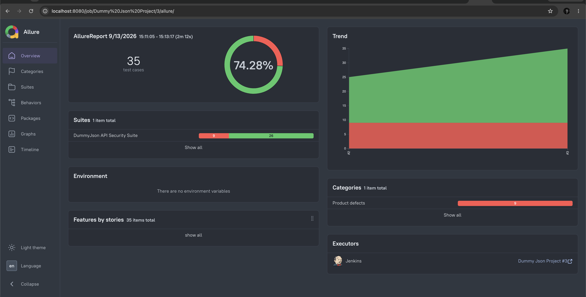
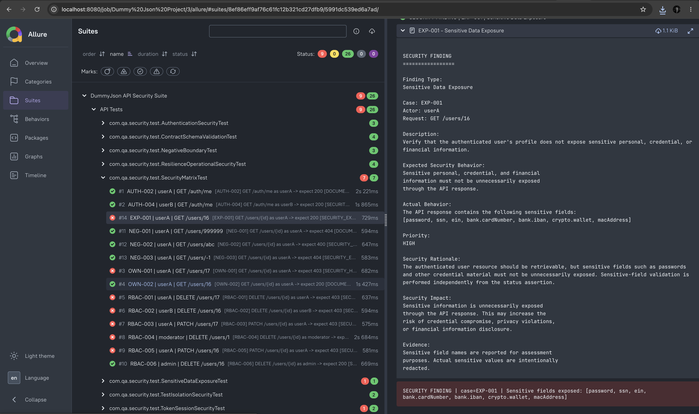
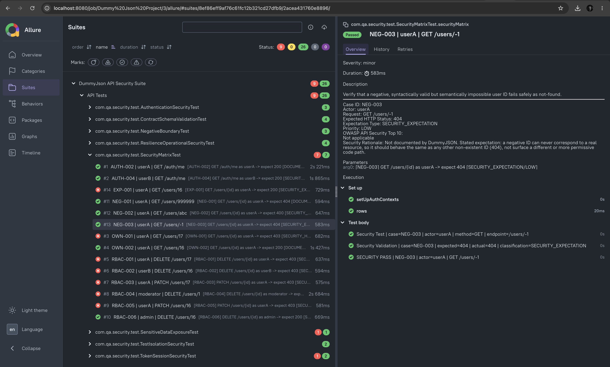
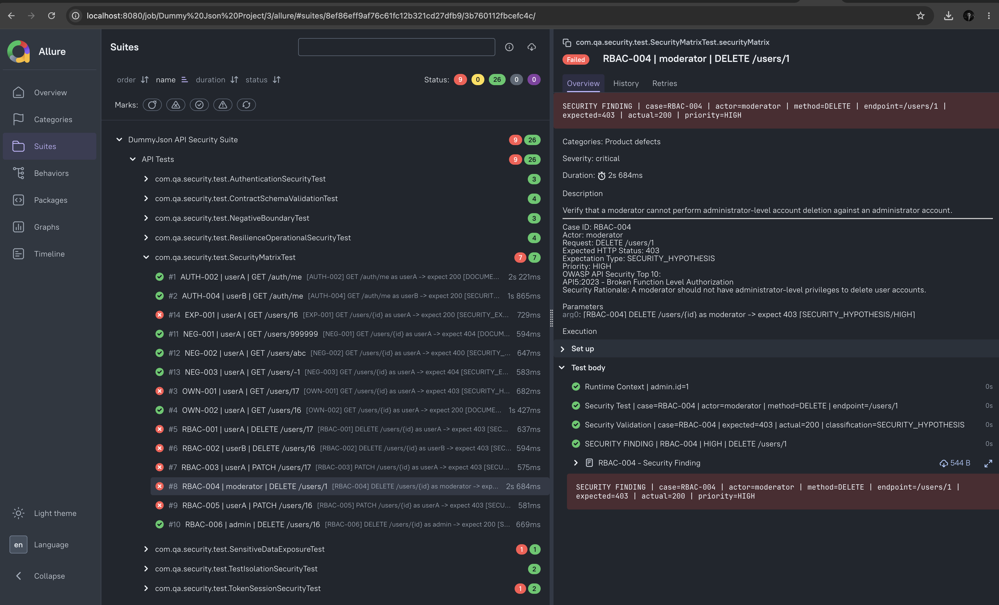

# DummyJSON API Security & RBAC Automation Framework

A data-driven API security automation framework built in **Java, RestAssured and TestNG**
to evaluate authentication, authorization, role-based access control (RBAC), resource
ownership, sensitive-data exposure, API contracts, negative/boundary behaviour, test
isolation, token/session handling, and resilience of the public **DummyJSON** sandbox
(`https://dummyjson.com`).

> **Target limitation.** DummyJSON is a public sandbox and does not implement a
> production-grade authorization model. This suite deliberately separates
> **documented API contract behaviour** from **stated production security
> expectations**, so a gap between the two is reported as a **security finding**
> rather than hidden or silently "fixed" by relaxing the assertion.

The objective of this framework is not to make every test green. The objective is to
distinguish between:

- documented API contract behaviour,
- stated production-security expectations,
- observed target behaviour, and
- genuine security findings or contract failures.

---

## 1. Technology Stack

| Technology | Purpose |
|---|---|
| Java 21 | Programming language / runtime |
| Maven | Build and dependency management |
| RestAssured 5.5.6 | REST API automation |
| TestNG 7.11.0 | Test execution and data-driven testing |
| Jackson 2.20.0 | JSON serialization / deserialization |
| Lombok | Model boilerplate reduction |
| Allure 2.35.1 | Test reporting and security evidence |
| Log4j2 | Structured application / test logging |
| Git / GitHub | Source control and version control |
| Jenkins | CI/CD execution |
| OWASP API Security Top 10 (2023) | Security risk classification |

Dependency versions are defined in `pom.xml`.

---

## 2. Setup

### Prerequisites
- Java 21 (JDK)
- Maven 3.9+
- Git
- Allure CLI (for viewing reports locally)
- Jenkins — optional, only needed for local CI/CD execution
- Internet access to `https://dummyjson.com` (no credentials required)

### Clone & Install


```bash
git clone https://github.com/zveda21/DummyJson.git
cd DummyJson
mvn -q dependency:resolve
```
## Repository

https://github.com/zveda21/DummyJson

### Configuration

No API keys, tokens, or `.env` files are required. `src/main/resources/config.properties`
holds the environment-specific values and can be overridden without touching source
code:

```properties
base.url=https://dummyjson.com

# Resilience configuration.
http.connect.timeout.ms=5000
http.read.timeout.ms=10000
```

```bash
mvn clean test -Dbase.url=https://dummyjson.com
```

`http.connect.timeout.ms` / `http.read.timeout.ms` set explicit connection and read
timeouts on `ApiClient`, so a hung request fails fast instead of stalling the suite.

Test user credentials are **not** hardcoded — they are resolved at runtime from the
public `/users` directory, grouped by the `role` field DummyJSON exposes
(`admin` / `moderator` / `user`).

---

## 3. Execution

### Run the full suite

```bash
mvn clean test
```

> **Note on runtime:** one test (`AUTH-005`, expired-token validation) sleeps for
> real for ~65 seconds to allow a short-lived token to genuinely expire, rather
> than mocking time. This is a deliberate trade-off — see *Limitations*.

### Run a specific TestNG suite / class

```bash
mvn test -DsuiteXmlFile=testng.xml
mvn -Dtest=SecurityMatrixTest test
```

### Generate and view the Allure report

The `allure-maven` plugin is configured in `pom.xml`, pointed at `allure-results/`
in the project root (where `allure-testng` writes its output), so Maven can drive
report generation directly:

```bash
mvn allure:report
mvn allure:serve
```

You can also use the Allure CLI directly against the same folder:

```bash
allure serve allure-results
```

Allure results are cleaned automatically at the start of each suite run
(`AllureReportCleaner`) so reports never mix data from different executions.

Logs are written to `logs/security-automation.log`. Authorization headers, tokens,
and passwords are redacted before anything is logged (see `ApiClient#sanitize`).

---

## 4. Architecture

```
                         TestNG Test Suite
                                |
        +-----------------------+-----------------------+
        |                       |                       |
        v                       v                       v
 Authentication          Security Matrix        Specialized Tests
      Tests                    |                  Negative / Schema /
                                |                  Exposure / Resilience
                                v
                       BaseSecurityTest
                                |
                 +--------------+--------------+
                 |                             |
                 v                             v
         AuthContextFactory              ApiAssertions
                 |                             |
                 +--------------+--------------+
                                |
                                v
                            ApiClient
                                |
                                v
                         DummyJSON API
```

The framework follows a layered design separating HTTP communication, authentication
context, configuration, models, assertions, security-matrix execution, and test
scenarios. `ApiClient` centralizes all HTTP interaction and request/response logging
with credential redaction. `BaseSecurityTest` provides the shared execution and
reporting engine used by every test class. Specialized test classes cover security
areas that don't fit the generic data-driven matrix shape (schema, negative/boundary,
resilience, isolation, token/session).

### Project structure

```
src/
├── main/
│   ├── java/
│   │   └── com/qa/security/
│   │       ├── assertions/         ApiAssertions — reusable status/field assertions
│   │       ├── client/             ApiClient — low-level HTTP wrapper (RestAssured)
│   │       ├── config/             ConfigManager — loads base.url/timeouts, no secrets in code
│   │       ├── constants/          ApiEndpoints, HttpStatusCodes
│   │       ├── models/
│   │       │   ├── request/
│   │       │   │   └── auth/       LoginRequest
│   │       │   └── response/
│   │       │       ├── auth/       LoginResponse, RefreshRequest
│   │       │       └── users/      UserSummary, UsersListResponse
│   │       ├── services/
│   │       │   ├── BaseService.java
│   │       │   ├── auth/           AuthService
│   │       │   └── users/          UserService
│   │       └── utils/              LoggerManager
│   └── resources/
│       ├── config.properties
│       └── log4j2.xml
│
└── test/
    ├── java/
    │   └── com/qa/security/
    │       ├── client/         AuthContextFactory, TestUserResolver
    │       ├── matrix/         SecurityMatrixRow, MatrixContext, SecurityMatrixProvider
    │       ├── test/           BaseSecurityTest, SecurityMatrixTest,
    │       │                   AuthenticationSecurityTest, TokenSessionSecurityTest,
    │       │                   ContractSchemaValidationTest, NegativeBoundaryTest,
    │       │                   TestIsolationSecurityTest,
    │       │                   ResilienceOperationalSecurityTest,
    │       │                   SensitiveDataExposureTest
    │       └── utils/          AllureReportCleaner, AllureTestReporter, SecurityFindingReporter
    └── resources/
        └── matrix/
            └── security-matrix.json
```

---

## 5. Test Strategy & Coverage

Priorities were driven by the security intent of the assessment, roughly in this order:

1. **Authentication boundary** — can protected endpoints be reached unauthenticated,
   with an invalid token, or with an expired token?
2. **Identity correctness** — does `/auth/me` return the identity that was actually
   authenticated, not some other user's?
3. **Resource ownership (BOLA)** — can one standard user read/modify/delete another
   user's resource?
4. **Role escalation** — can a standard user or moderator perform an admin-level
   action, or elevate their own role?
5. **Safe failure** — does a non-existent or malformed request fail safely, without
   leaking internal detail or causing a 5xx?
6. **Sensitive data exposure** — does a legitimate, authorized (or even anonymous)
   response still leak fields like passwords, bank details, or MAC addresses?
7. **State isolation** — does authentication/token state leak across users or
   concurrent executions?
8. **Operational resilience** — do documented delays or unusual-but-valid input
   (e.g. large pagination) cause unexpected failures?

Each matrix row's `rationale` field states *why* that outcome is expected, and
`owaspCategories` maps it to the OWASP API Security Top 10 (2023), so a security
stakeholder can scan the matrix without reading test code.

### 5.1 Authentication & Identity — `AuthenticationSecurityTest`, `SecurityMatrixTest`
Validates anonymous access to protected resources, invalid access tokens, expired
access tokens, and identity consistency for authenticated users (`AUTH-001` to
`AUTH-005`). The tests distinguish authentication failure from authorization failure.

### 5.2 Token & Session Handling — `TokenSessionSecurityTest`
Covers refresh-token behaviour, invalid refresh tokens, access-token/session
behaviour after refresh, and identity consistency across token operations
(`REFRESH-001` to `REFRESH-003`). Assumptions not guaranteed by the target's
documentation are classified as `SECURITY_HYPOTHESIS` rather than asserted as fact.

### 5.3 Role-Based Access Control — `SecurityMatrixTest` + `security-matrix.json`
Validates role boundaries for standard users, moderators, and admins, including
destructive and privilege-changing operations (`RBAC-001` to `RBAC-006`). A 200
response is never automatically treated as a pass when the security expectation is
403 — the mismatch is reported as a security finding instead.

### 5.4 Resource Ownership / BOLA — `OWN-001`, `OWN-002`
Verifies that a standard user cannot read, modify, or delete another user's resource.
Where DummyJSON returns 200 instead of the expected 403, this is reported as a
security finding rather than silently accepted as correct behaviour.

### 5.5 Sensitive Data Exposure — `SensitiveDataExposureTest`
Checks authorized *and* anonymous responses for sensitive fields such as `password`,
SSN, EIN, `bank.cardNumber`, `bank.iban`, `crypto.wallet`, and MAC address, at the
field level rather than relying only on HTTP status.

### 5.6 API Contract & Schema Validation — `ContractSchemaValidationTest`
Validates HTTP status, response deserialization, required fields, response
structure, expected data types, and non-empty collections — going beyond
status-code-only assertions to catch response-shape drift.

### 5.7 Negative & Boundary Testing — `NegativeBoundaryTest`, `SecurityMatrixTest`
Covers non-existent IDs, non-numeric IDs, negative IDs, malformed JSON, unexpected
`Content-Type`, and injection-style authentication input (`NEG-001` to `NEG-006`).
Malformed JSON and bad content types use `ApiClient`'s raw-request capability.
Verifies invalid input fails safely rather than producing unexpected success or a
server-side error.

### 5.8 Test Isolation & Concurrency — `TestIsolationSecurityTest`
Checks for authentication-context leakage, shared token state, identity
contamination, and consistency of authenticated identities under a controlled
number of concurrent requests (not load/stress testing, which is explicitly out
of scope for a public sandbox).

### 5.9 Resilience & Operational Behaviour — `ResilienceOperationalSecurityTest`
Covers documented response delay, repeated invalid requests, and large/excessive
pagination parameters (`RES-001` to `RES-004`), verifying that these don't produce
unexpected 5xx responses or false timeouts — without asserting an absolute
performance SLA.

---

## 6. Data-Driven Security Matrix

```
security-matrix.json
        |
        v
SecurityMatrixProvider
        |
        v
SecurityMatrixRow
        |
        v
SecurityMatrixTest
        |
        v
Authentication Context
        |
        v
ApiClient
        |
        v
Response
        |
        v
Security Classification
```

Authorization, ownership, and RBAC scenarios are represented externally in
`security-matrix.json`, so adding a new authorization scenario means adding a JSON
row, not writing a new test method.

```json
{
  "caseId": "RBAC-001",
  "roleKey": "userA",
  "method": "DELETE",
  "endpointTemplate": "/users/{id}",
  "pathParams": { "id": "{{userB.id}}" },
  "body": null,
  "expectedStatus": 403,
  "expectationType": "SECURITY_HYPOTHESIS",
  "priority": "HIGH",
  "description": "Verify that a standard user cannot delete another user's account.",
  "owaspCategories": ["API5:2023 - Broken Function Level Authorization"],
  "rationale": "A standard user should not be able to perform a destructive operation on another user's account."
}
```

The matrix currently holds **14 rows** (`AUTH-002/004`, `OWN-001/002`, `RBAC-001`–`006`,
`NEG-001`–`003`, `EXP-001`), covering the identity, ownership, RBAC, negative, and
exposure areas. Scenarios that don't fit this row shape — schema validation
(`SCHEMA-001`–`004`), malformed-input handling (`NEG-004`–`006`), token/session
(`REFRESH-001`–`003`), isolation (`ISO-001`–`002`), resilience (`RES-001`–`004`), and
the remaining authentication cases (`AUTH-001/003/005`) — are implemented directly
as TestNG methods in their respective specialized test classes instead.

Every row is classified as one of:

- **`DOCUMENTED_CONTRACT`** — behaviour explicitly documented by DummyJSON; a
  mismatch is a genuine automation/contract bug.
- **`SECURITY_EXPECTATION`** — behaviour DummyJSON does not document but a
  production system should enforce; a mismatch is a security finding.
- **`SECURITY_HYPOTHESIS`** — a proposed security control where the target's
  documentation does not establish the policy as a formal contract.

---

## 7. Security Classification Model

```
                Security Expectation
                       |
                       v
                 Actual Response
                       |
          +------------+------------+
          |            |            |
          v            v            v
         PASS      SECURITY      CONTRACT
                    FINDING       FAILURE
```

| Result | Meaning |
|---|---|
| `PASS` | Actual behaviour matched the expectation |
| `SECURITY FINDING` | A `SECURITY_EXPECTATION`/`HYPOTHESIS` row did not hold |
| `CONTRACT FAILURE` | A `DOCUMENTED_CONTRACT` row did not hold |

A security expectation is **never** changed simply because DummyJSON returns a
successful response. Example: expected `403`, actual `200` → still reported as a
`SECURITY FINDING`, never silently converted to a pass.

---

## 8. OWASP Mapping

| Security Area | OWASP API Risk (2023) |
|---|---|
| Resource Ownership | API1 – Broken Object Level Authorization |
| Authentication | API2 – Broken Authentication |
| Token / Session | API2 – Broken Authentication |
| Sensitive Data | API3 – Broken Object Property Level Authorization |
| Resilience | API4 – Unrestricted Resource Consumption |
| RBAC | API5 – Broken Function Level Authorization |
| Negative / Input Validation | API8 – Security Misconfiguration |
| Contract / Schema | API8 – Security Misconfiguration |

The OWASP mapping is used to provide security context and prioritization, not to
claim that every observed behaviour is formally an OWASP-defined vulnerability.

---

## 9. Security Findings Observed

- **Cross-user resource access (`OWN-001`, `SECURITY_HYPOTHESIS`)** — a standard
  user was able to retrieve another user's resource; expected `403`, actual `200`
  → **SECURITY FINDING**.
- **Broken function-level authorization (`RBAC-001`–`RBAC-005`, `SECURITY_HYPOTHESIS`)**
  — lower-privileged users were able to perform `DELETE`/`PATCH` operations
  expected to be restricted → **SECURITY FINDING**, deliberately retained rather
  than adjusted to match the observed 200/success response.
- **Sensitive data exposure** — user responses exposed fields including `password`,
  SSN, EIN, `bank.cardNumber`, `bank.iban`, `crypto.wallet`, and MAC address.
- **Positive authorization behaviour (`RBAC-006`)** — the admin `DELETE /users/{id}`
  scenario returned the expected `200`, confirming the framework tests both
  unauthorized and authorized paths correctly.

---

## 10. Test Results & Reporting

Test execution produces Allure results under `allure-results/` at the project root.
Allure
attaches case ID, actor/role, HTTP method, endpoint, expected/actual status,
security classification, priority, and OWASP category — so a failed security test
is understandable to QA, engineering, and security stakeholders without reading
implementation code. Log4j2 provides structured execution logging in parallel;
sensitive request-body fields (`password`, `token`, `accessToken`,
`authorization`) are sanitized before anything is written to logs or reports.

---

### Allure Report

The Jenkins pipeline generates the test execution results and publishes the Allure
report(passed case, failed case, failed case details).









## 11. CI/CD & Version Control

```
Developer
    |
    v
Git Commit
    |
    v
GitHub
    |
    v
Jenkins
    |
    v
Maven
    |
    v
TestNG Suite
    |
    +----> Logs
    |
    +----> Allure Results
    |
    v
Build / Test Status
```

The project is maintained in Git and pushed to GitHub. A local Jenkins server was
configured to execute the automation suite from the repository (`Jenkinsfile`)
rather than relying only on manual local execution, demonstrating the framework is
runnable both locally via Maven and through a CI/CD pipeline. No credentials or
secrets are committed to version control.

---

## 12. Assumptions

- Test user credentials are **not** supplied or hardcoded — they're resolved at
  runtime from the public `/users` directory, grouped by role.
- A standard user should not be able to view, modify, or delete another user's
  resource, or change their own or another account's `role` — stated as production
  security expectations, not asserted as documented DummyJSON behaviour.
- `PATCH`/`DELETE` responses from DummyJSON are simulated and not expected to
  persist; assertions target the HTTP status/shape of that single call, not
  follow-up state.

## 13. Limitations & Incomplete Areas

- DummyJSON is a public sandbox, not a production authorization system — its
  dataset may change and behaviour may vary over time.
- Simulated CRUD operations may not persist the way a production system would.
- Public-network latency can vary; resilience tests avoid treating arbitrary
  latency as a security failure.
- `AUTH-005` takes ~65 real seconds (genuine token-expiry wait, not mocked) — a
  deliberate trade-off, not currently isolated into a separate/optional TestNG
  group.
- Boundary/negative coverage, while broadened, does not exhaustively cover every
  malformed-input permutation.
- No load testing, stress testing, credential stuffing, or high-volume fuzzing was
  performed — explicitly out of scope for a shared public sandbox.
- Some security expectations are proposed production controls (`SECURITY_HYPOTHESIS`)
  rather than behaviour formally documented by DummyJSON.

### Future improvements
- Expand disposable test-data management for destructive scenarios.
- Add stronger persistence verification for privilege-changing operations.
- Extend schema validation to additional endpoints.
- Grow the security matrix as new authorization scenarios are identified.

---

## 14. Actual Assessment Effort

**Day 1** — Designed the automation architecture, separated framework layers
(client, services, models, config, assertions, test), implemented the initial API
client and authentication context handling, designed the security-matrix
structure, and implemented the first security scenarios.

**Day 2** — Expanded coverage: RBAC, ownership, token/session, negative/boundary,
isolation/concurrency, sensitive-data exposure, and resilience tests. Added OWASP
mapping and Allure reporting. Set up Git/GitHub version control and a local
Jenkins server, then configured and validated the Jenkins pipeline.

**Day 3** — Reviewed coverage against the assessment brief, added missed
scenarios, cleaned up structure and logging, validated the TestNG suite and Allure
reporting, reviewed the Jenkins execution flow, and finalized this README.

<!-- TODO: replace with actual total hours if you're tracking them, e.g.
     "~18 hours over 3 days" -->

---

## 15. AI-Assisted Development Disclosure

AI tools were used during development, after the initial architecture and
framework layering were designed independently. Tools used: **ChatGPT** and
**Claude** (free versions).

AI assistance was used for:
- test scenario brainstorming
- reviewing the proposed architecture and API-client design
- OWASP API Security Top 10 mapping suggestions
- code review / refactoring suggestions
- debugging assistance (Java / Maven / TestNG)
- logging and Allure-reporting structure suggestions
- documentation wording and README structuring

AI-generated suggestions were not treated as authoritative. All output was
independently reviewed and validated through local compilation, Maven/TestNG
execution, actual DummyJSON API responses, Allure results, and log output. The
author remains responsible for the final architecture, implementation, security
expectations, assertions, findings, and this documentation.

---

## 16. Final Assessment Position

The framework prioritizes security reasoning, maintainable automation, reusable
architecture, data-driven testing, useful evidence, and honest classification of
findings over simply maximizing test count. It is capable of establishing
authentication contexts, executing a data-driven authorization matrix, testing
RBAC and resource ownership, detecting sensitive-data exposure, validating API
contracts, testing malformed/boundary input, checking session/token behaviour and
state isolation, running controlled resilience checks, and producing structured
Allure evidence — all executable via Maven/TestNG locally and through a Jenkins
CI/CD pipeline integrated with GitHub. Observed security gaps are intentionally
preserved and reported as findings rather than hidden by changing expected
outcomes.

---

## 17. References

- DummyJSON API: https://dummyjson.com
- DummyJSON docs: https://dummyjson.com/docs
- OWASP API Security Top 10 (2023): https://owasp.org/APISecurity/editions/2023/en/0x11-t10/
- RestAssured: https://rest-assured.io/
- TestNG: https://testng.org/
- Allure Report: https://allurereport.org/
- Jenkins: https://www.jenkins.io/
- Maven: https://maven.apache.org/

**Repository:** `https://github.com/zveda21/DummyJson`
**Jenkins pipeline:** `Jenkinsfile`
**TestNG suite:** `testng.xml`
**Security matrix:** `src/test/resources/matrix/security-matrix.json`
